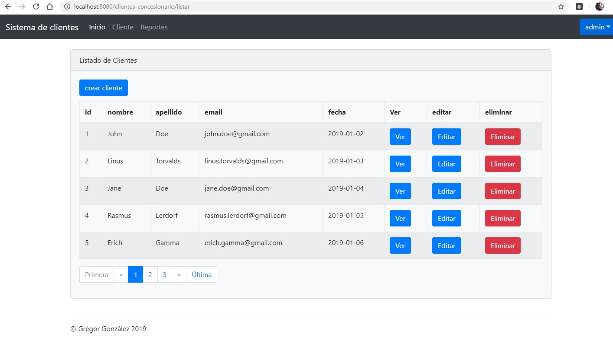

# Sistema de Control de Clientes - Concesionario
Examen realizado para CONSULTEC-IT por Grégor González

## Tecnologías Usadas

-  Java EE, Spring-MVC 5, JPA
- Base de datos H2. Para no tener que instalar un manejador de bd y realizar pruebas directamente.
- IDE Netbeans con JDK 1.8
- Servidor: Tomcat 9 [Descargar](https://tomcat.apache.org/download-90.cgi)

Accesos:  
Usuario: Admin  
Passord: 1234  

Pantalla de Ejemplo:

